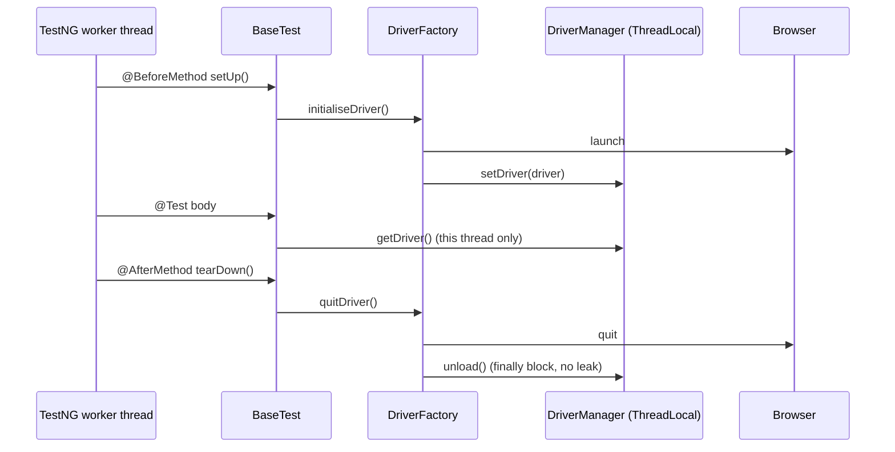

# EnterpriseAutomationFramework

Production-grade hybrid Selenium automation framework (Page Object Model + Data Driven), built for
parallel execution, rich reporting and zero-touch CI integration.

| | |
|---|---|
| **Project Owner** | Lalith Kumar BV |
| **Designation** | Senior Software Engineer |
| **Prepared By** | Lalith Kumar BV |
| **Framework Version** | 1.0 |
| **Document Version** | 1.0 |

---

## 1. Technology stack

| Layer | Technology |
|---|---|
| Language | Java 21 |
| Browser automation | Selenium WebDriver 4.x |
| Build | Apache Maven |
| Test runner | TestNG 7.x |
| Driver binaries | WebDriverManager + Selenium Manager |
| Logging | Log4j2 (console + rolling file + error file) |
| Reporting | Extent Reports (Spark), TestNG HTML, TestNG Emailable, Surefire |
| Test data | Apache POI (XSSF) |
| Email | Jakarta Mail (Angus implementation) |
| Helpers | Apache Commons IO, Apache Commons Lang3 |
| Quality gate | SonarQube (sonar-maven-plugin) |

---

## 2. Folder structure

```
EnterpriseAutomationFramework
├── pom.xml
├── README.md
├── logs/                                     generated at runtime
├── test-output/                              generated at runtime
└── src
    ├── main
    │   └── java/com/enterprise/automation
    │       ├── base/          BaseTest
    │       ├── config/        ConfigReader
    │       ├── constants/     FrameworkConstants
    │       ├── driver/        DriverFactory, DriverManager
    │       ├── email/         EmailUtility
    │       ├── enums/         BrowserType, ConfigKey
    │       ├── exceptions/    FrameworkException
    │       ├── listeners/     TestListener, RetryAnalyzer, RetryTransformer
    │       ├── pages/         BasePage + 4 page objects
    │       ├── reports/       ReportManager, ExtentTestManager, ExecutionSummary
    │       └── utilities/     Wait, Screenshot, Excel, JavaScript, Actions,
    │                          Dropdown, Alert, Window, Logger, Date, TestDataRow
    └── test
        ├── java/com/enterprise/automation/tests
        │       AmazonHomePageTest, FlipkartHomePageTest,
        │       WikipediaHomePageTest, SeleniumHomePageTest
        └── resources
                config.properties
                log4j2.xml
                testng.xml
                testng-smoke.xml
                testdata.xlsx
```

---

## 3. Architecture

```mermaid
flowchart TD
    A[testng.xml<br/>parallel=methods, thread-count=4] --> B[TestListener<br/>ITestListener + ISuiteListener]
    A --> C[RetryTransformer<br/>IAnnotationTransformer]
    C --> D[RetryAnalyzer]
    A --> E[Test Classes]
    E --> F[BaseTest<br/>@BeforeMethod / @AfterMethod]
    F --> G[DriverFactory]
    G --> H[DriverManager<br/>ThreadLocal WebDriver]
    E --> I[Page Objects<br/>extends BasePage]
    I --> H
    I --> J[Utilities<br/>Wait / JS / Actions / Alert / Window / Dropdown]
    B --> K[ReportManager<br/>ExtentReports singleton]
    B --> L[ExtentTestManager<br/>ThreadLocal ExtentTest]
    B --> M[ScreenshotUtility]
    B --> N[ExcelUtility<br/>Apache POI write-back]
    B --> O[EmailUtility<br/>Jakarta Mail]
    P[config.properties] --> Q[ConfigReader]
    Q --> G
    Q --> J
    Q --> K
    Q --> O
```

### Thread-safety model



---

## 4. Prerequisites

* JDK 21 installed and `JAVA_HOME` set
* Apache Maven 3.9+
* Google Chrome (or Firefox / Edge if you switch the `browser` property)
* Internet access on first run, so WebDriverManager can resolve the driver binary

---

## 5. Import into an IDE

**Eclipse**
1. `File → Import → Maven → Existing Maven Projects`
2. Select the `EnterpriseAutomationFramework` folder, tick `pom.xml`, click **Finish**
3. Wait for the dependency download to finish
4. `Project → Properties → Java Build Path → Libraries` — confirm the JRE is **JavaSE-21**
5. Install the TestNG plug-in from Eclipse Marketplace if you want to run suites from the IDE

**IntelliJ IDEA**
1. `File → Open` and select the `pom.xml`, then choose **Open as Project**
2. `File → Project Structure → Project` — set the SDK to **21** and the language level to **21**
3. Let Maven finish importing; the TestNG plug-in is bundled

---

## 6. How to execute

```bash
# Full suite, settings from config.properties
mvn clean test

# Headless, useful in CI
mvn clean test -Dheadless=true

# Different browser and thread count
mvn clean test -Dbrowser=edge -Dthread.count=2

# Smoke group only
mvn clean test -DsuiteXmlFile=src/test/resources/testng-smoke.xml

# Different environment label in the report
mvn clean test -Denvironment=UAT
```

From the IDE, right-click `src/test/resources/testng.xml` and choose **Run as TestNG Suite**.

Any key in `config.properties` can be overridden with `-Dkey=value`; the system property always wins.

---

## 7. Outputs

| Artefact | Location |
|---|---|
| Extent report | `test-output/ExtentReports/ExtentReport.html` |
| Screenshots | `test-output/Screenshots/` |
| TestNG HTML + Emailable report | `test-output/surefire-reports/` |
| Surefire XML/TXT | `test-output/surefire-reports/` |
| Execution log | `logs/execution.log` |
| Error-only log | `logs/error.log` |
| Excel result write-back | `src/test/resources/testdata.xlsx` |

---

## 8. Test data

`testdata.xlsx`, sheet `TestData`:

| Column | Direction | Purpose |
|---|---|---|
| TestCaseId | in | Unique key; the listener writes results back against it |
| TestCaseName | in | Description shown in reports |
| ApplicationUrl | in | Address under test |
| ExpectedTitleFragment | in | Case-insensitive fragment the title must contain |
| Execute | in | `YES` enables the row |
| Status | out | PASS / FAIL / SKIP |
| ExecutionTimestamp | out | When the test finished |
| ExecutionTimeMs | out | Duration in milliseconds |
| ScreenshotPath | out | Absolute path of the captured image |

Title assertions match a **fragment**, not an exact string, because production sites change their
titles frequently. That keeps the suite stable without weakening the check.

---

## 9. Email notification

Disabled by default. To switch it on, set in `config.properties`:

```properties
email.enabled=true
email.username=your.address@gmail.com
email.password=<16-character app password, not your login password>
email.to=qa.team@yourcompany.com
```

Gmail requires an **App Password** with 2-Step Verification enabled. Never commit a real password —
inject it in CI instead: `mvn clean test -Demail.enabled=true -Demail.password=$SMTP_PASSWORD`.

Attachments: Extent report, TestNG emailable report, TestNG index report, Surefire report,
`execution.log`, and up to ten screenshots.

---

## 10. Adding a new test

1. Add a row to `testdata.xlsx` with a new `TestCaseId`
2. Create a page object in `pages/` extending `BasePage`; declare locators as
   `private static final By` constants under a `LOCATORS` section, actions under an `ACTIONS` section
3. Create a test class in `tests/` extending `BaseTest`
4. Call `markTestCaseId("TC_00X")` at the start so results are written back to Excel
5. Register the class in `testng.xml`

Do **not** create a WebDriver, capture screenshots or close the browser inside a test —
`BaseTest` and `TestListener` already handle all three.

---

## 11. SonarQube

```bash
mvn clean verify sonar:sonar \
  -Dsonar.host.url=http://localhost:9000 \
  -Dsonar.login=$SONAR_TOKEN
```

Design decisions taken specifically for the quality gate: no magic numbers (everything in
`FrameworkConstants`), no duplicated string literals (`ConfigKey` enum), private constructors on
every utility class, try-with-resources on every stream, a single custom `RuntimeException` type,
and no empty catch blocks.

---

## 12. Troubleshooting

| Symptom | Cause | Fix |
|---|---|---|
| `SessionNotCreatedException` | Chrome and chromedriver versions differ | Update Chrome, or clear `~/.cache/selenium` and `~/.m2/repository/webdriver` |
| `FrameworkException: No WebDriver is bound to thread` | Test class does not extend `BaseTest` | Extend `BaseTest` |
| `Unable to load configuration file` | Suite launched from the wrong working directory | Run from the project root so `user.dir` resolves correctly |
| Extent report is empty | Listener not registered | Confirm the `<listeners>` block in `testng.xml` |
| Excel columns stay blank | `markTestCaseId(...)` not called, or ID not in the sheet | Call it, and check the `TestCaseId` value |
| Email not sent | `email.enabled=false`, or an ordinary password used | Enable it and use an app password |
| Tests are slow but not parallel | Suite XML overridden | Confirm `parallel="methods"` and `thread-count="4"` |
| `UnsupportedClassVersionError` | IDE compiling against an older JDK | Set the project SDK and language level to 21 |

---

## 13. Version history

| Version | Date | Author | Change |
|---|---|---|---|
| 1.0 | 28-Jul-2026 | Lalith Kumar BV | Initial release |

---

## 14. Future enhancements

Selenium Grid / cloud grid support, Docker Compose execution, Allure reporting, API + UI hybrid
layer, Cucumber BDD wrapper, database validation utility, visual regression checks, accessibility
scanning, GitHub Actions and Jenkins pipelines, self-healing locators.
